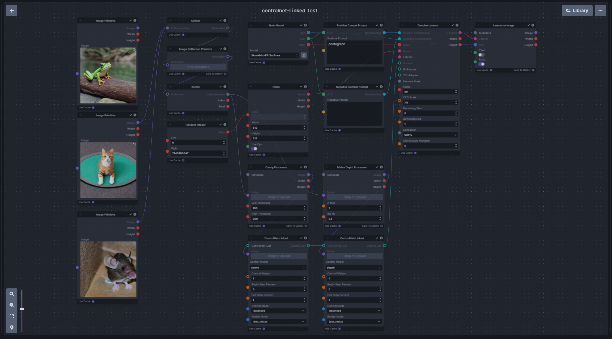
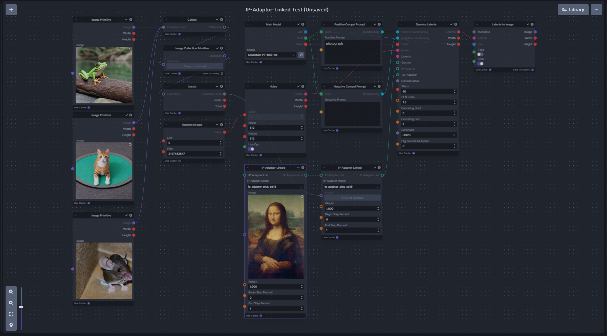
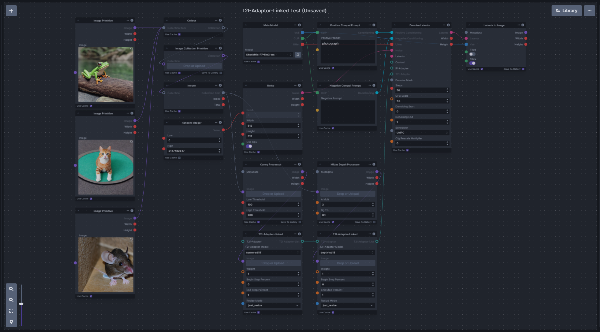
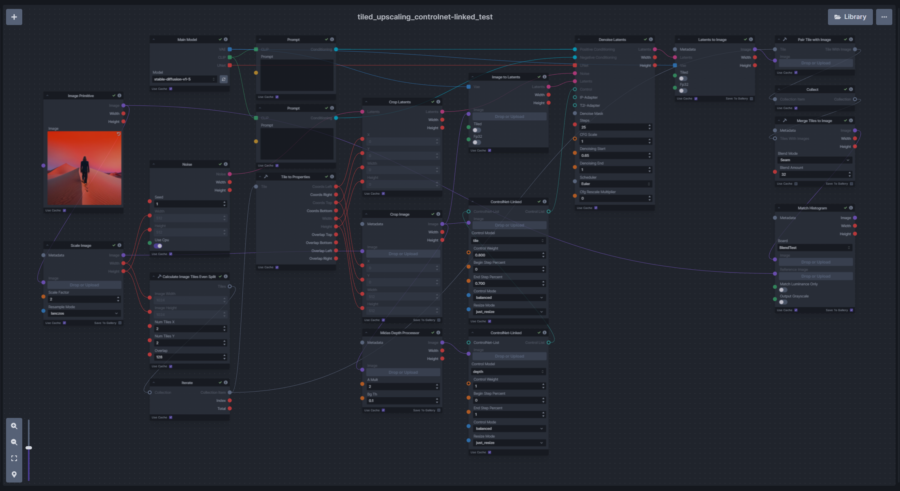

# `adapters-linked-nodes` for InvokeAI (v3.5+)
A set of InvokeAI nodes for linked adapters (ControlNet, IP-Adaptor & T2I-Adapter). This allows multiple adapters to be chained together without using a collect node which means it can be used inside an `iterate` node without collecting on every iteration.

- `ControlNet-Linked` - Collects ControlNet info to pass to other nodes.
- `IP-Adapter-Linked` - Collects IP-Adapter info to pass to other nodes.
- `T2I-Adapter-Linked` - Collects T2I-Adapter info to pass to other nodes.

Note: These are inherited from the core nodes so any update to the core nodes should be reflected in these. 

## Usage
### <ins>Install</ins><BR>
There are two options to install the nodes:

1. **Recommended**: Git clone into the `invokeai/nodes` directory. This allows updating via `git pull`.

    - In the InvokeAI nodes folder, run:
    ```bash
    git clone https://github.com/skunkworxdark/adapters-linked-nodes.git
    ```

2. Manually download [adapters_linked.py](adapters_linked.py) & [__init__.py](__init__.py) then place them in a subfolder under `invokeai/nodes`. 

### <ins>Update</ins><BR>
Run a `git pull` from the `adapters-linked-nodes` folder.

Or run `update.bat`(windows) or `update.`sh`(Linux).

For manual installs, download and replace the files.

### <ins>Remove</ins><BR>
Delete the `adapters-linked-nodes` folder. Or rename it to `_adapters-linked-nodes`` so InvokeAI will ignore it.

## ToDo
- suggestions

# Example Usage

[controlnet-linked_workflow.json](workflows/controlnet-linked_workflow.json)


[ip-adaptor-linked_workflow.json](workflows/ip-adaptor-linked_workflow.json)


[t2i-adaptor-linked_workflow.json](workflows/t2i-adaptor-linked_workflow.json)


[tiled_upscaling_controlnet-linked_workflow.json](workflows/tiled_upscaling_controlnet-linked_workflow.json)

